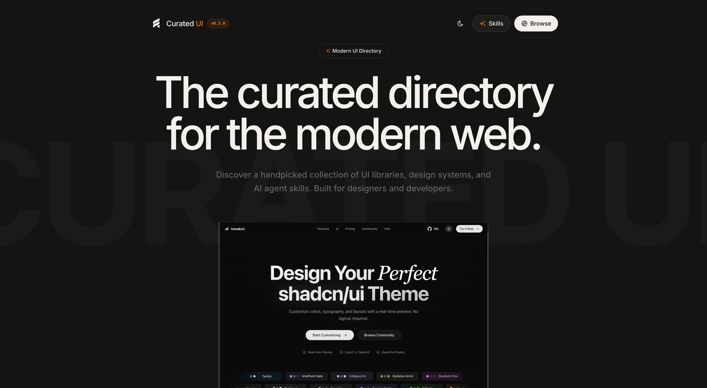

# Curated UI



**Curated UI** is a handpicked directory of modern web UI libraries, design systems, animation tools, typography pairings, and ready-to-use **AI Agent Skills**. Designed for developers, designers, and AI-assisted workflows to build exceptional web interfaces faster.

---

## 🌟 Key Features

- 🎨 **Curated UI & Design Resources:** Hand-picked React/Tailwind UI component libraries, micro-animation tools, color palettes, and icons.
- 🤖 **AI Agent Skills Directory:** Pre-built agent guidelines & rule sets (Karpathy Guidelines, Next.js App Router patterns, Shadcn UI workflows, Tailwind v4 docs) with one-click `npx skills add` copy commands for AI coding assistants (Claude, Cursor, Antigravity, Windsurf).
- ⚡ **Instant Search & Filtering:** Search by category or keyword using stateful URL parameters (`nuqs`) and smooth animations (`motion`).
- 📸 **Automated Screenshot Generator:** Headless browser integration with Puppeteer to fetch crisp screenshots of listed web resources automatically.

---

## 🛠️ Tech Stack

- **Framework:** [Next.js 16 (App Router)](https://nextjs.org/) & [React 19](https://react.dev/)
- **Styling:** [Tailwind CSS v4](https://tailwindcss.com/)
- **Components:** [shadcn/ui](https://ui.shadcn.com/) & [@base-ui/react](https://base-ui.com/)
- **Icons:** [Tabler Icons React](https://tabler.io/icons)
- **Animations:** [Motion](https://motion.dev/) & [tw-animate-css](https://github.com/n3r4zzurr0/tw-animate-css)
- **State & Virtualization:** [nuqs](https://nuqs.47ng.com/) & [react-virtuoso](https://virtuoso.dev/)
- **Automation:** [Puppeteer](https://pptr.dev/) (captures local screenshots to bypass external runtime dependencies)
- **Package Manager / Runtime:** [Bun](https://bun.sh/)

---

## 🚀 Getting Started

### 1. Clone & Install Dependencies

```bash
git clone https://github.com/zeropse/curated-ui.git
cd curated-ui
bun install
```

### 2. Fetch Screenshots (Optional / First Setup)

To capture screenshots for newly added sites in `src/data/sites.js`:

```bash
bun run fetch-images
```

_*Note: Screenshots are saved directly to `public/images/` to avoid third-party API rate limits during runtime.*_

### 3. Run Development Server

```bash
bun dev
```

Open [http://localhost:3000](http://localhost:3000) in your browser to explore the app.

---

## 📂 Directory Structure

```text
curated-ui/
├── scripts/
│   └── downloadImages.js    # Puppeteer screenshot capture script
├── src/
│   ├── app/                 # Next.js App Router pages (browse, skills, faq, privacy, terms)
│   ├── components/          # Reusable UI components & shadcn primitives
│   ├── data/
│   │   ├── sites.js         # Curated list of web UI tools & libraries
│   │   └── skills.js        # Curated list of AI Agent skills & guidelines
│   ├── hooks/               # Custom React hooks
│   └── lib/                 # Utility functions & helpers
└── public/
    └── images/              # Downloaded resource screenshots
```

---

## ➕ Adding New Resources

### Adding a Web UI Site

1. Open `src/data/sites.js`.
2. Append a new site object to the `sites` array:
   ```javascript
   {
     name: "Library Name",
     url: "https://example.com",
     category: "UI Components",
     description: "Short description of the resource.",
     imageSlug: "library-name"
   }
   ```
3. Run `bun run fetch-images` to capture the site's screenshot automatically.

### Adding an AI Agent Skill

1. Open `src/data/skills.js`.
2. Append a new skill object to the `skills` array:
   ```javascript
   {
     name: "Skill Name",
     category: "Category Name",
     description: "Detailed description of the skill and rules.",
     source: "author/repo-name",
     url: "https://skills.sh/author/repo-name",
     copyCommand: "npx skills add author/repo-name"
   }
   ```

---

## 📜 Available Scripts

| Command                | Description                                |
| :--------------------- | :----------------------------------------- |
| `bun dev`              | Runs the Next.js dev server with Turbopack |
| `bun run build`        | Builds the production bundle               |
| `bun run start`        | Runs the built production server           |
| `bun run lint`         | Runs ESLint checks                         |
| `bun run fetch-images` | Runs the Puppeteer screenshot fetch script |

---

## 📄 License

MIT © [zeropse](https://github.com/zeropse)
